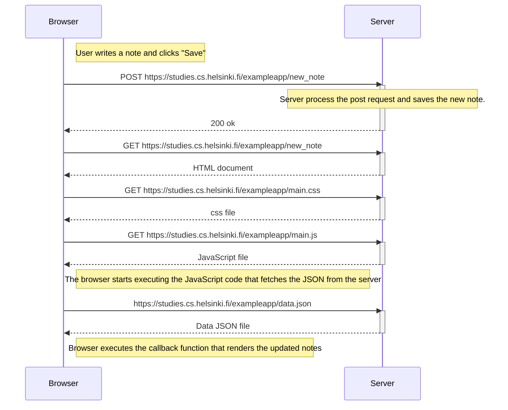
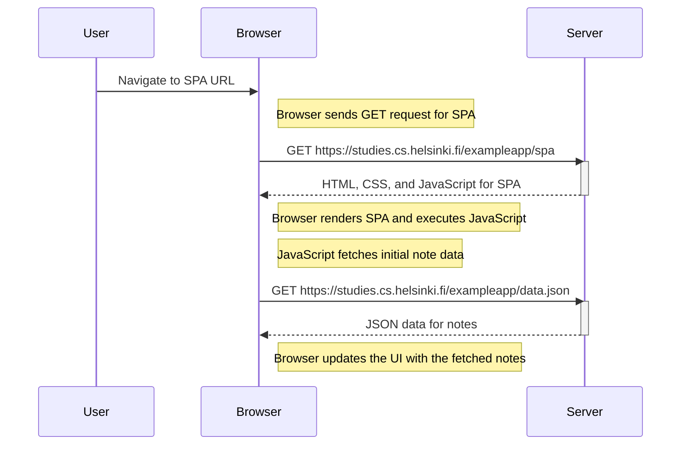
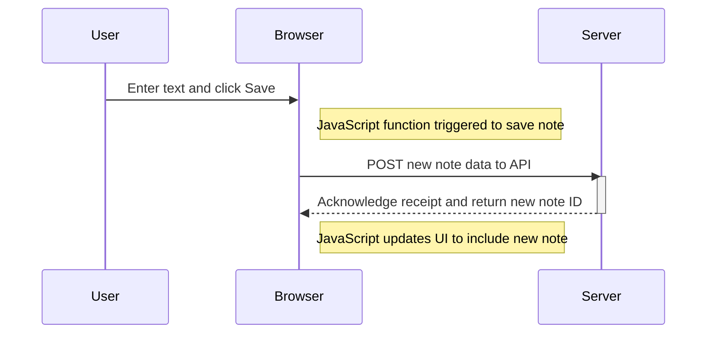

$$Exercise 0.4$$

``` mermaid
sequenceDiagram
    participant Browser
    participant Server

    Note right of Browser: User writes a note and clicks "Save"

    Browser ->> Server: POST https://studies.cs.helsinki.fi/exampleapp/new_note
    activate Server
    Note over Server: Server process the  post request and saves the new note.
    Server -->> Browser: 200 ok
    deactivate Server

    Browser ->> Server: GET https://studies.cs.helsinki.fi/exampleapp/new_note
    activate Server
    Server -->> Browser: HTML document
    deactivate Server

    Browser ->> Server: GET https://studies.cs.helsinki.fi/exampleapp/main.css
    activate Server
    Server -->> Browser: css file
    deactivate Server

    Browser ->> Server: GET https://studies.cs.helsinki.fi/exampleapp/main.js
    activate Server
    Server -->> Browser: JavaScript file
    deactivate Server

    Note right of Browser: The browser starts executing the JavaScript code that fetches the JSON from the server

    Browser ->> Server: https://studies.cs.helsinki.fi/exampleapp/data.json
    activate Server
    Server -->> Browser: Data JSON file
    deactivate Server

    Note right of Browser: Browser executes the callback function that renders the updated notes
```

$$Exercise 0.5$$

```mermaid
sequenceDiagram
    participant User
    participant Browser
    participant Server

    User ->> Browser: Navigate to SPA URL
    Note right of Browser: Browser sends GET request for SPA

    Browser ->> Server: GET https://studies.cs.helsinki.fi/exampleapp/spa
    activate Server
    Server -->> Browser: HTML, CSS, and JavaScript for SPA
    deactivate Server

    Note right of Browser: Browser renders SPA and executes JavaScript
    
    Note right of Browser: JavaScript fetches initial note data

    Browser ->> Server: GET https://studies.cs.helsinki.fi/exampleapp/data.json
    activate Server
    Server -->> Browser: JSON data for notes
    deactivate Server

    Note right of Browser: Browser updates the UI with the fetched notes
```

$$Excersie 0.6$$

```mermaid
sequenceDiagram
    participant User
    participant Browser
    participant Server

    User->>Browser: Enter text and click Save
    Note right of Browser: JavaScript function triggered to save note

    Browser->>Server: POST new note data to API
    activate Server
    Server-->>Browser: Acknowledge receipt and return new note ID
    deactivate Server

    Note right of Browser: JavaScript updates UI to include new note
```
